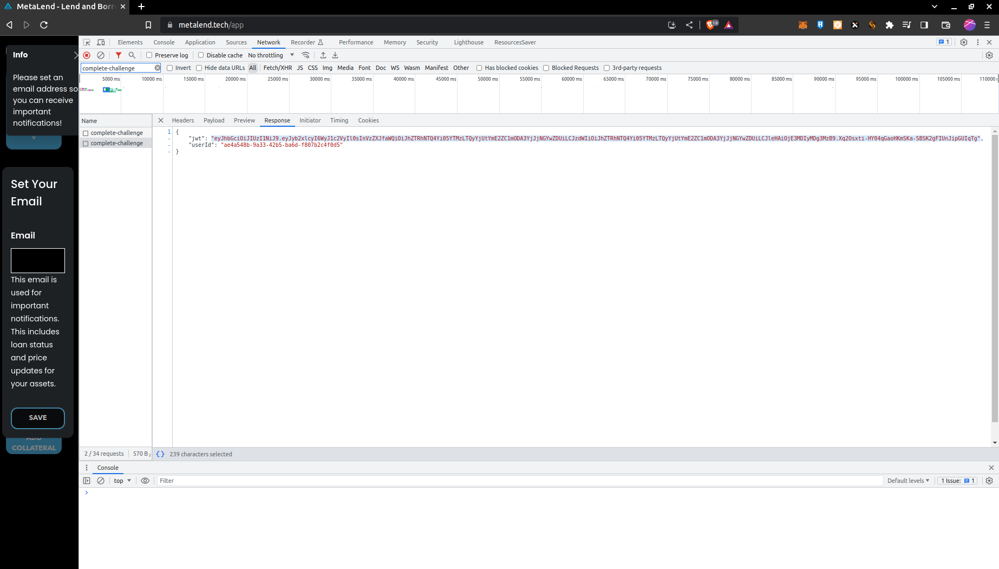

# MetaLend Liquidations
Whenever a borrower gets into shortfall their assets can be liquidated to bring them back under borrow limit. ERC721 assets can be liquidated at https://metalend.tech/marketplace while liquidations of fungible tokens (AXS or RON) are suitable for bots. Follow the guide further to set up yours. Please note: this guide assumes the reader has a foundational understanding of programming, and basic blockchain concepts, as well as familiarity with blockchain libraries like ethers.js and programming language Solidity. Liquidations are being done by repaying user's borrow while receiving specific collateral with discount in exchange.

## How to
1. Get an API key
    * go to https://metalend.tech/app
    * open console - network
    * connect your wallet and look for `complete-challenge` request
    * check response and copy your `jwt` - this is your API key
    
2. Get a list of shortfall borrowers
    * using any programming language make a get request to https://api.metalend.tech/liquidation/v2/get-borrowers while passing your JWT as "Authorization" header
    * the data returned is an object with addresses of all shortfall borrowers to their respective shortfall denominated in wei WETH. The amount of shortfall reflects approximately how much can be liquidated from the borrower
    * please keep in mind the endpoint is limited to 1 request per 1 minute. We update the list once per half an hour anyway, so further requests are not necessary
    * example request in javascript:
```javascript
import axios from "axios";

axios.defaults.withCredentials = true;

const axiosApi = axios.create({
  baseURL: "https://api.metalend.tech/liquidation",
  timeout: 15000,
  headers: {
    "Content-type": "application/json",
  },
});

const setupAxios = () => {
  axiosApi.interceptors.request.use(function (request) {
    const token = "<YOUR_JWT_KEY_STRING>";
    request.headers["Authorization"] = token;
    return request;
  });

  axiosApi.interceptors.response.use(
    function (response) {
      return response;
    },
    function (error) {
      if (error.response) {
        throw error.response.data.message;
      } else if (error.request) {
        // The request was made but no response was received
        throw error.request;
      } else {
        // Something happened in setting up the request that triggered an Error
        throw error.message;
      }
    }
  );
};

class Api {
  constructor() {
    setupAxios();
  }

  async getBorrowers() {
    return await axiosApi.get(`/v2/get-borrowers`);
  }
}

export const api = new Api();
```

3. Now that you have a list of borrowers, you can call several view functions with chain requests
    * setup your provider with Ronin RPC - https://api.roninchain.com/rpc
    * `function getTotalBorrows(address account) external view returns (uint);`
        * target contract - Liquidity Assessor: `0x9E97f0A5b8582A336123667338992D8A8499CdF3` https://app.roninchain.com/address/ronin:9e97f0a5b8582a336123667338992d8a8499cdf3
        * this returns the total borrows of given account denominated in wei WETH representation
    * `function borrowBalanceStored(address account) public view returns (uint);`
        * target contracts - borrow/lend markets
        * WETH: `0x446450d57b4F26691b6cfac92BAdBA5C8D875a4E` https://app.roninchain.com/address/0x446450d57b4f26691b6cfac92badba5c8d875a4e
        * USDC: `0x3eBC36b9545B4b858b1f233d8F2D933C0858F5f4` https://app.roninchain.com/address/0x3ebc36b9545b4b858b1f233d8f2d933c0858f5f4
        * RON: `0x1Bf2b273745DF6a38E5e5f907DcD4d204A4bfE30` https://app.roninchain.com/address/0x1bf2b273745df6a38e5e5f907dcd4d204a4bfe30
        * this returns the borrows of an acount denominated in the market currency, wei 18 decimals representation for WETH/RON markets, 6 decimals representation for USDC market
        * each borrower can have borrow active only in 1 market kind at a time
        * the borrower must be liquidated in their currently active market
    * `function getAccountTokens(address account) external view returns (uint);`
        * target contracts - fungible tokens collateral contracts
        * RON Collateral: `0x6DB7Bd2Fa4B1B89C56C08b553d7c04Df0301E885` https://app.roninchain.com/address/0x6db7bd2fa4b1b89c56c08b553d7c04df0301e885
        * AXS Collateral: `0xC737cCA751142ac9b51cB8ef475042DfCea9287a` https://app.roninchain.com/address/0xc737cca751142ac9b51cb8ef475042dfcea9287a
        * this returns the balance of the account for AXS/RON collateral in wei representation
        * this value is important because you cannot liquidate more tokens than the user has
4. At this point you have a list of shortfall borrowers, their active borrow markets and their collateral balances, let's start with liquidations.
5. You will need a private key of an account with enough balance of the underlying tokens of the markets you will be liquidating users in. Get enough RON, WETH and USDC. We recommend using a secondary account created for liquidations. For WETH and USDC you will also have to approve the market to be able to spend your tokens. Liquidations will be processed in the markets mentioned above:
    * WETH: `0x446450d57b4F26691b6cfac92BAdBA5C8D875a4E`
    * USDC: `0x3eBC36b9545B4b858b1f233d8F2D933C0858F5f4`
    * RON: `0x1Bf2b273745DF6a38E5e5f907DcD4d204A4bfE30`
6. In one transaction, the repay amount can be only up to user's `borrowAmount * closeFactor`. Close factor is at this moment 10% and is unlikely to be changed. Nevertheless, you can get the close factor with this view function:
    * `function getCloseFactorMantissa() external view returns (uint);`
        * target contract - Comptroller: `0x9E8FD99Fc64Cd2fF4B5846361a7eC457f2b3808e` https://app.roninchain.com/address/0x9e8fd99fc64cd2ff4b5846361a7ec457f2b3808e
    * it returns the close factor with 18 decimals representation (e.g. 100000000000000000 = 0.1)
7. Parameters you will need for liquidation
    1. address of the borrower
    2. repay amount - the amount you want to repay for the borrower during the liquidation in WETH/USDC/RON depending on the active borrow market of the borrower. See below how to get a valid repay amount param.
    3. address of the collateral contract - either `0x6DB7Bd2Fa4B1B89C56C08b553d7c04Df0301E885` for RON Collateral or `0xC737cCA751142ac9b51cB8ef475042DfCea9287a` for AXS Collateral
    4. appraisal
        * you can get an appraisal by sending a get request to https://api.metalend.tech/liquidation/v2/get-appraisal with your JWT as the "Authorization" header. Don't forget to pass the borrower's address as a query param `address`
        * please, keep in mind this endpoint is limited to 1 request per 5 seconds
        * you will have to process the response a little based on your environment:
          * convert each `appraisal.appraisalValues` string to `uint256`, e.g. `BigNumber` if using ethers.js
          * prepend `0x01` to `appraisal.signature` while slicing the first two characters of the signature
        * examples in `JavaScript` using `ethers.js` and in `Kotlin` using `web3j`:

```javascript
const response = await axiosApi.get(`/v2/get-appraisal?address=${address}`);
const appraisal = response.data;

appraisal.appraisalValues = appraisal.appraisalValues.map((e) =>
  BigNumber.from(
    e.toLocaleString("fullwide", {
      useGrouping: false,
    })
  ).toString()
);

appraisal.signature = `0x01${appraisal.signature.slice(2)}`;
return appraisal;
```

```kotlin
class CustomDynamicStruct(
    vararg values: Type<*>
) : DynamicStruct(values.toList()), StructType {
    private val itemTypes = mutableListOf<Class<Type<*>>>()

    init {
        for (value in values) {
            itemTypes.add(value.javaClass)
        }
    }

    override fun bytes32PaddedLength(): Int {
        return super.bytes32PaddedLength() + 32
    }

    override fun getTypeAsString(): String {
        val type = StringBuilder("(")
        for (i in itemTypes.indices) {
            val value = getValue()[i]
            val typeAsString = if (value is Array<*>) {
                AbiTypes.getTypeAString(value.componentType) + "[]"
            } else {
                value.typeAsString
            }
            type.append(typeAsString)
            if (i < itemTypes.size - 1) {
                type.append(",")
            }
        }
        type.append(")")
        return type.toString()
    }
}

CustomDynamicStruct(
    DynamicArray(Address::class.java, appraisal.appraisalTokens.map { Address(it) }),
    DynamicArray(
        Uint256::class.java,
        appraisal.appraisalLengths.map { Uint256(BigInteger.valueOf(it.toLong())) }
    ),
    DynamicArray(Uint256::class.java, appraisal.appraisalTokenIds.map { Uint256(BigInteger(it)) }),
    DynamicArray(Uint256::class.java, appraisal.appraisalValues.map { Uint256(BigInteger(it)) }),
    Uint256(BigInteger(appraisal.appraisalGoodUntil)),
    DynamicBytes(Numeric.hexStringToByteArray("0x01" + appraisal.signature.substring(2)))
)
```

8. Getting a repay amount param
    * the amount of the collateral to be liquidated is calculated based on the input param repay amount, current conversion prices of the given tokens and liquidation incentive
    * it is scaled by 18 decimals for WETH/RON markets and 6 decimals for USDC market. Meaning repaying 1 USDC would be repay amount = 1000000 while repaying 1 WETH would be repay amount = 1000000000000000000.
    * repay amount cannot be greater than close factor. As long as borrower is in shortfall, they can be liquidated.
    * the resulting colateral amount to be liquidated cannot exceed user's collateral balance of the given token
    * this means if person has enough collateral, you can liquidate up to close factor of the borrow balance, or you can liquidate all of the collateral if the conversion fits under the 10% close factor, however in this case you have to calculate the precise repay amount which converts to the required collateral amount
    * this is how the amount of collateral to be seized is evaluated in the contracts:

```solidity
function liquidateCalculateSeizeCErc20Collateral(
    address cTokenBorrowed, // borrow market
    address cErc20CollateralToken, // collateral contract
    uint repayAmount // scaled by 18 decimals for WETH/RON markets, 6 decimals for USDC market
) external view returns (uint, uint) {
    /* Read oracle prices for borrowed and collateral markets */
    uint priceBorrowedMantissa = comptroller.getOracle().getUnderlyingPrice(CTokenInterface(cTokenBorrowed));
    uint priceCollateralMantissa = comptroller.getOracle().getUnderlyingPrice(CTokenInterface(cErc20CollateralToken));
    if (priceBorrowedMantissa == 0 || priceCollateralMantissa == 0) {
        return (uint(Error.PRICE_ERROR), 0);
    }

    uint liquidationIncentiveLocal = comptroller.getMarketLiquidationIncentive(cErc20CollateralToken);
    if (liquidationIncentiveLocal == 0) {
        return (uint(Error.INVALID_LIQUIDATION_INCENTIVE), 0);
    }

    uint seizeTokens;
    Exp memory numerator;
    Exp memory ratio;

    numerator = mul_(Exp({mantissa: liquidationIncentiveLocal}), Exp({mantissa: priceBorrowedMantissa}));
    ratio = div_(numerator, Exp({mantissa: priceCollateralMantissa}));

    seizeTokens = mul_ScalarTruncate(ratio, repayAmount);

    return (uint(Error.NO_ERROR), seizeTokens);
}
```

* you can either use this view function - target contract is Liquidity Assessor: `0x9E97f0A5b8582A336123667338992D8A8499CdF3` https://app.roninchain.com/address/ and then adjust the repay amount if the returning `seizeTokens` value is greater than the user's collateral balance
* or you can recreate the calculation off-chain
    * you can get `uint priceBorrowedMantissa` and `uint priceCollateralMantissa` by using view function `function getUnderlyingPrice(CTokenInterface cToken) public view returns (uint256);` to target contract - Price Oracle: `0x3ea08443db91f3CbF1FbCAD2b2D1ca3f4c582fBf` https://app.roninchain.com/address/0x3ea08443db91f3cbf1fbcad2b2d1ca3f4c582fbf with param address of the borrow market/collateral contract
        * value returned is scaled by decimals of the underlying token
    * you can get `uint liquidationIncentiveLocal` by using view function `function getMarketLiquidationIncentive(address market) external view returns (uint);` to target contract - Comptroller: `0x9E8FD99Fc64Cd2fF4B5846361a7eC457f2b3808e` https://app.roninchain.com/address/0x9e8fd99fc64cd2ff4b5846361a7ec457f2b3808e while using the collateral contract address as the param
        * value returned is scaled by 18 decimals and is unlikely to be changed. Current value is 1100000000000000000 (1.1 ... 110%).
    * see `ExponentialNoError.sol` in this repository for `mul_`, `div_`, `mul_ScalarTruncate_` functions and `Exp` struct
* afterwards calculating the amount would be done by recreating and inverting the process off-chain. E.g. by using Kotlin:

```kotlin
val erc20CollateralBalance = // getAccountTokens function response
val currentBorrows = // borrows of user
val closeFactor = // close factor mantissa parsed from 18 decimals to 1.1
val closeFactorRepayAmount = currentBorrows.toBigDecimal().multiply(closeFactor).toBigInteger() // denominated in 18 decimals for WETH/RON and 6 decimals for USDC

val continueLiquidationAndRepayAmount = getRepayAmountBasedOnCollateralBalanceAndPrice( // see function below
    closeFactorRepayAmount,
    erc20CollateralBalance,
    marketToLiquidate, // WETH/USDC/RON
    tokenKind, // collateral contract underlying token
)

internal fun getRepayAmountBasedOnCollateralBalanceAndPrice(repayAmountCloseFactor: BigInteger, collateralBalance: BigInteger, marketKind: MarketKind, tokenKind: TokenKind): Pair<Boolean, BigInteger> {
    val marketContract = // address of the borrow market
    val tokenContract = // address of the collateral market

    val expScale = BigInteger("1000000000000000000")
    val liquidationIncentive = // response to getMarketLiquidationIncentive
    val priceBorrowedMantissa = // reponse to getUnderlyingPrice with borrow market address
    val priceCollateralMantissa = // reponse to getUnderlyingPrice with collateral market address

    val numerator = priceBorrowedMantissa.multiply(liquidationIncentive).divide(expScale)
    val ratio = numerator.multiply(expScale).divide(priceCollateralMantissa)

    val seizeTokens = ratio.multiply(repayAmountCloseFactor).divide(expScale)

    return if (collateralBalance > seizeTokens) {
        // if 101% seize tokens is more than collateral balance, liquidate with 98% repayAmount and don't continue for tokenKind
        // else liquidate with 98% repay amount and continue next iteration of liquidations for tokenKind
        if (collateralBalance < seizeTokens.multiply(BigInteger("101")).divide(BigInteger("100"))) {
            // if this happens most of the user's collateral is liquidated for this specific collateral token and it's no longer necessary to do further liquidations of this collateral
            false to repayAmountCloseFactor.multiply(BigInteger("98")).divide(BigInteger("100"))
        } else {
            // otherwise there is enough collateral for next batch of liquidation (2 different transactions)
            true to repayAmountCloseFactor.multiply(BigInteger("98")).divide(BigInteger("100"))
        }
    } else {
        // if person does not have enough collateral to fit under the 10% close factor repay amount
        // else liquidate with repay amount equaling 98% of collateral balance and don't continue for tokenKind
        val numerator2 = priceBorrowedMantissa.multiply(liquidationIncentive).divide(expScale)
        val ratio2 = numerator2.multiply(expScale).divide(priceCollateralMantissa)
        val repayAmount = collateralBalance.multiply(expScale).divide(ratio2)
        false to repayAmount.multiply(BigInteger("98")).divide(BigInteger("100"))
    }
}
```

9. Having all necessary params you can proceed with liquidations
    * first use view function `function liquidateBorrowAllowed(address cTokenBorrowed, address cTokenCollateral, address borrower, uint repayAmount, AppraisalStruct.Wire memory appraisal) public view returns (uint);` (see attached `ABI.json` in this repository) with the params in this order: 1. borrow market, 2. collateral contract address, 3. borrower address, 4. repay amount, 5. appraisal
        * target contract - Liquidity Assessor: `0x9E97f0A5b8582A336123667338992D8A8499CdF3` https://app.roninchain.com/address/ronin:9e97f0a5b8582a336123667338992d8a8499cdf3
        * this function returns 0 if person can be liquidated and any other number if the liquidation would fail with given params. Here are some codes for most common errors:
            * 17 - TOO_MUCH_REPAY = repay amount is greater than borrow balance * close factor
            * 3 - INSUFFICIENT_SHORTFALL = person is no longer in shortfall, they were either liquidated meanwhile or they got out of shortfall a different way
        * please note: this function does not check if person has enough collateral balance to cover the passed repay amount
    * if you get a positive response from the `liquidateBorrowAllowed` function you can now send a liquidation transaction
    * there are 2 liquidation functions based on market
        * WETH and USDC function: `function liquidateBorrowAndRedeemErc20CollateralStaking(address borrower, uint repayAmount, CErc20CollateralInterface cErc20CollateralToken, AppraisalStruct.Wire memory appraisal) public returns (uint);`
        * RON function: `function liquidateBorrowAndRedeemErc20CollateralStaking(address borrower, CErc20CollateralInterface cErc20CollateralToken, AppraisalStruct.Wire memory appraisal) public payable;`
        * difference is that for WETH and USDC repay amount is passed as a param, while for RON it's passed as a payable value of the transaction
        * params for WETH and USDC in this order: 1. borrower address, 2. repay amount, 3. collateral contract address, 4. appraisal
        * params for RON in this order: 1. borrower address, 2. collateral contract address, 3. appraisal + pass repay amount as msg.value
        * send the transactions to these contracts based on borrowers active borrow market:
            * WETH: `0x446450d57b4F26691b6cfac92BAdBA5C8D875a4E`
            * USDC: `0x3eBC36b9545B4b858b1f233d8F2D933C0858F5f4`
            * RON: `0x1Bf2b273745DF6a38E5e5f907DcD4d204A4bfE30`
        * collateral contract addresses
            * RON Collateral: `0x6DB7Bd2Fa4B1B89C56C08b553d7c04Df0301E885`
            * AXS Collateral: `0xC737cCA751142ac9b51cB8ef475042DfCea9287a`
10. Finalizing liquidations - once the transaction is send with proper parameters there are a few outcomes
    1. transaction completely fails 
        * check your gas limit! the prediction may have failed. You can recognize this by checking if the gas spent is close to 100%.
        * transaction may have reverted by e.g. borrower having not enough collateral balance
    2. transaction succeeds, but liquidation fails
        * if there is no revert and transaction succeeds but no tokens have been liquidated, the liquidation failed due to various reasons. You can recognize the failure by checking the logs emitted by the transaction and if it contains a log with topic `0x45b96fe442630264581b197e84bbada861235052c5a1aadfff9ea4e40a969aa0` it means failed. If this happens, no tokens are liquidated and no tokens are transferred out of your wallet. This can happen for example when the person gets out of shortfall before your transaction is confirmed, if repay amount is incorrect after borrow balance shift / underlying price shift.
    3. transaction succeeds and tokens are transferred - congratulations!
  